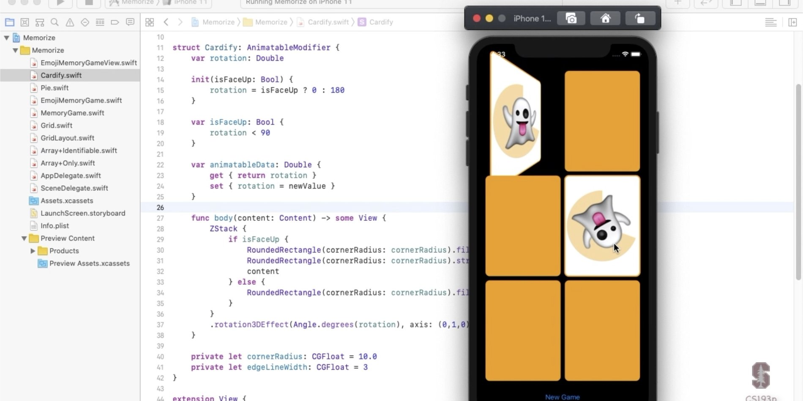

# Memorize

A card-matching game developed with Xcode 12.3 for iOS using SwiftUI.

# Images

  
   
  

  
   
  

# Lecture Information

[Paul Hegarty](https://www.quora.com/Who-is-Paul-Hegarty-from-Stanford-CS193) covers the logistics of the course and then dives right into creating an iOS application (a card-matching game called Memorize).

[CS193p lecture videos and information](https://cs193p.sites.stanford.edu/)

[More information about CS193p](https://cs193p.sites.stanford.edu/about-cs193p)
